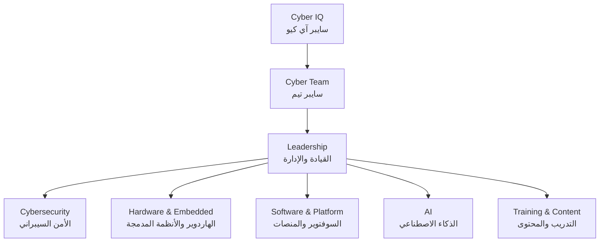

# Cyber Team — الفريق

**سايبر تيم (Cyber Team)** هو الفريق التقني لشركة **سايبر آي كيو**. انطلق من قسم هندسة الشبكات والأمن السيبراني — كلية الهندسة، الجامعة العراقية، ويضم 10 أعضاء يعملون ضمن ست وحدات.

## الهيكل التنظيمي

## الوحدات والمهام

| الوحدة | المسؤوليات | الأعمال المرتبطة |
|---|---|---|
| **القيادة والإدارة** | إدارة الشركة والفريق، العلاقات مع الجامعات والمؤسسات، توزيع المهام، متابعة الخطة | [ROADMAP.md](ROADMAP.md) |
| **الأمن السيبراني** | مراكز العمليات الأمنية، مراقبة الشبكات، كشف التهديدات اللاسلكية، تقييم الأمن ضمن نطاق مصرّح به | CS-SOC · TV-Box-HomeSOC · Evil-Twin-Detector · Wireless-Security-Tester |
| **الهاردوير والأنظمة المدمجة** | تصميم الأجهزة وبناؤها، منظومات SDR، تجهيز المختبرات والشبكات والسيرفرات، الصيانة | Cyber-Shield · CSS · TSS · Lab-Setup · Laptop-Maintenance |
| **السوفتوير والمنصات** | تطوير المنصة التعليمية والمواقع، برمجة الأنظمة المدمجة، لوحات المراقبة | المنصة التعليمية · TV-Box-HomeSOC · Cyber-Shield |
| **الذكاء الاصطناعي** | تحليل التهديدات والإشارات بالذكاء الاصطناعي، كورسات AI | TSS · CS-SOC |
| **التدريب والمحتوى** | الورش، الكورسات العامة على المنصة، تحديات CTF | Workshop-Academic-Horizons · Workshop-CTF |

## المسميات الوظيفية المعتمدة

| الوحدة | المسمى الوظيفي (عربي) | Job title (English) |
|---|---|---|
| القيادة والإدارة | المؤسس والمدير التنفيذي | Founder & CEO |
| القيادة والإدارة | المدير التقني | Chief Technology Officer (CTO) |
| القيادة والإدارة | مدير العمليات والعلاقات | Operations & Partnerships Manager |
| الأمن السيبراني | رئيس وحدة الأمن السيبراني | Head of Cybersecurity |
| الأمن السيبراني | محلل مركز عمليات أمنية | SOC Analyst |
| الأمن السيبراني | مهندس أمن الشبكات واللاسلكي | Network & Wireless Security Engineer |
| الهاردوير والأنظمة المدمجة | رئيس وحدة الهاردوير | Head of Hardware |
| الهاردوير والأنظمة المدمجة | مهندس أنظمة مدمجة | Embedded Systems Engineer |
| الهاردوير والأنظمة المدمجة | مهندس بنية تحتية وشبكات | Infrastructure & Network Engineer |
| السوفتوير والمنصات | رئيس وحدة السوفتوير | Head of Software |
| السوفتوير والمنصات | مطوّر Full-Stack | Full-Stack Developer |
| الذكاء الاصطناعي | رئيس وحدة الذكاء الاصطناعي | Head of AI |
| الذكاء الاصطناعي | مهندس ذكاء اصطناعي | AI Engineer |
| التدريب والمحتوى | رئيس وحدة التدريب | Head of Training |
| التدريب والمحتوى | مدرّب ومصمم تحديات CTF | Trainer & CTF Challenge Designer |

## الأعضاء

| # | الاسم | المسمى الوظيفي | الوحدة | حساب جيت هاب |
|---|---|---|---|---|
| 1 | مقتدى الصدر جار الله خليف | يُحدَّد | يُحدَّد | [@hfsduu5-coder](https://github.com/hfsduu5-coder) |
| 2 | أكرم قاسم كرم | يُحدَّد | يُحدَّد | يُضاف |
| 3 | عبدالله خليل محمد | يُحدَّد | يُحدَّد | يُضاف |
| 4 | علي عاصم شاكر | يُحدَّد | يُحدَّد | يُضاف |
| 5 | أحمد جميل عامر | يُحدَّد | يُحدَّد | يُضاف |
| 6 | محمد باقر حسين عباس | يُحدَّد | يُحدَّد | يُضاف |
| 7 | مصطفى لؤي كامل | يُحدَّد | يُحدَّد | يُضاف |
| 8 | عمار حيدر علي | يُحدَّد | يُحدَّد | يُضاف |
| 9 | آمنة صالح كاظم | يُحدَّد | يُحدَّد | يُضاف |
| 10 | ضحى محمد نوماس | يُحدَّد | يُحدَّد | يُضاف |

## الفريق على جيت هاب

كل وحدة لها فريق (Team) داخل مؤسسة CYBERIQ-HQ، تحت الفريق الأم `@CYBERIQ-HQ/cyber-team`. عند إضافة حساب أي عضو إلى المؤسسة يُضاف إلى فريق وحدته.

| الوحدة | فريق جيت هاب |
|---|---|
| القيادة والإدارة | `@CYBERIQ-HQ/leadership` |
| الأمن السيبراني | `@CYBERIQ-HQ/cybersecurity` |
| الهاردوير والأنظمة المدمجة | `@CYBERIQ-HQ/hardware` |
| السوفتوير والمنصات | `@CYBERIQ-HQ/software` |
| الذكاء الاصطناعي | `@CYBERIQ-HQ/ai` |
| التدريب والمحتوى | `@CYBERIQ-HQ/training` |

---

## English summary

**Cyber Team** is Cyber IQ's engineering team: 10 members, organised in six units: Leadership · Cybersecurity · Hardware & Embedded · Software & Platform · AI · Training & Content. Each unit has a GitHub team under `@CYBERIQ-HQ/cyber-team`; members are added to their unit's team when their accounts join the organisation. Titles and units are assigned per member in the table above.
